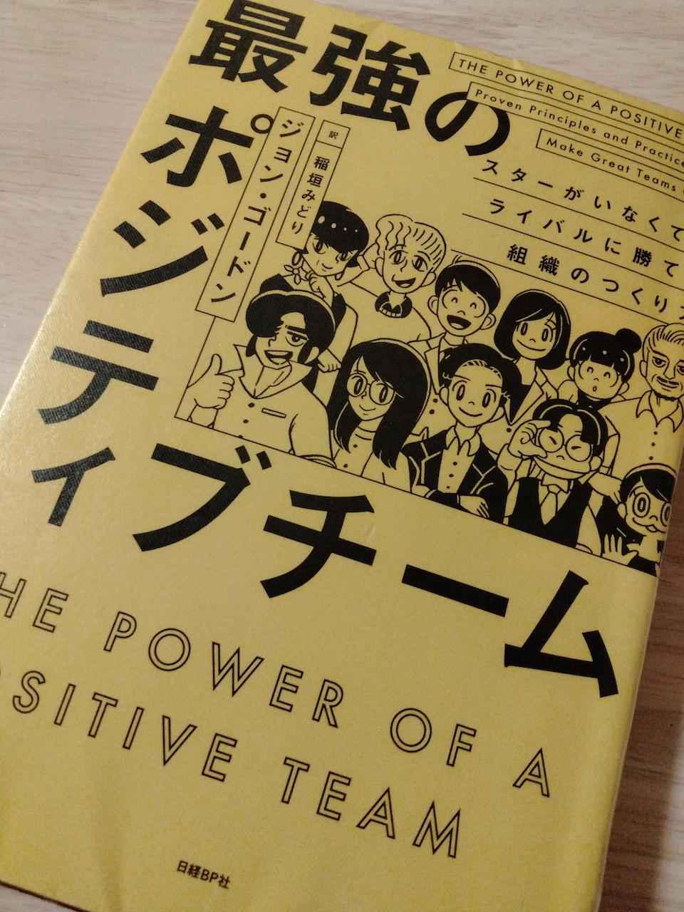

# 最強のポジティブチーム(ジョン・ゴードン)を読んで[書評]

[[toc]]

## どんな本か

「ポジティブなチームには力がある」  
ポジティブなチームになるためには何をすればいいのか、著者自身のチームについての経験と、歴史に名を残す偉大なチームの一員だった人たちへのインタビューを通じて実績のある原則や習慣が紹介された本です。  
[最強のポジティブチーム](https://www.amazon.co.jp/dp/4822289575)  
※英書は[こちら](https://www.amazon.com/dp/1119430240)

## どんな人に読んでほしいか

- プロジェクトチームがギスギスした感じでチーム運用がうまくいっていない、と感じている人  
チームメンバー全員が読み、共通の認識として持って欲しいと感じました。

## 印象に残った点はどこか

ポジティブなチームの考え方や、ポジティブなチームになるための方法が沢山紹介されています。プロジェクトチームでの活動をうまく運用する手段としてはどれも基本的なことだと感じました。個人的に印象に残った点をいくつか紹介します。

### 感情は感染力がある。ポジティブなエネルギーを感染させよう

チームで作業をしているとまさにその通りだなと感じます。中には、感情に影響を受けない強い心を持っている人もいたりしますが、少なくともネガティブなエネルギーよりも、ポジティブなエネルギーを発し続けていたほうがチームに良い方向に向かうのかなと思います。  
著書では、
> 自分はチームにとって病原菌になるのか、あるいは大量のビタミンCになるのか、どちらだろうか。

という言い回しで表現されていました。ビタミンCになろう。

### 互いに励まし合う

`ランニングで一人で走りきれなかったっ距離を、友人に励ましてもらったことで走り切ることができた。`という著者自身のエピソードがあります。特にスポーツだと当たり前のことだと思いますが、普段プロジェクトチームとして一緒に仕事をしている間柄だと、忙しかったりして意外と忘れているのかなと感じました。  
励まされた人は個々人として強くなり、その結果チーム自体も強くなります。困っていたり辛い状況で戦っているチームメンバーがいたら、励ましてポジティブなエネルギーを分け与えられるようにしたいです。

### チームを強くする妨げになっているのは、好かれたいという個人の思い

チームで作業をしている限り、メンバー間で意見が異なり、時として衝突することがあると思います。異なる意見は、チームとして強くなるチャンスの一つだと思っています。著書でも、
> 意見がぶつかることもなく、チームメンバーに対していつでもニコニコしているのがポジティブな状態だというイメージを持っている人もりうからだ。それは大きな誤りだ。

とあり、異なる意見を回避する行動は必ずしもポジティブになる訳ではない、とされているようです。  
この考え方は同感で、プロジェクトチームで仕事をしている時は常に意識をしている点でしたが、改めて必要なんだなと認識しました。異なる意見も受け止め、チームとしてどのように取り入れるべきかを考えてみることが、結果ポジティブなチームになると思っています。

## まとめ

上記で紹介した点以外にも、ポジティブで強いチームになるための要素が散りばめられた著書だと思います。日頃チームのことを真剣に考えているリーダーやメンバーであれば、既に知っている内容が出てくるかと思いますが、自分の考え方は間違っていないのだなと再確認もできるので、気になった方はぜひ読んでみてください。
