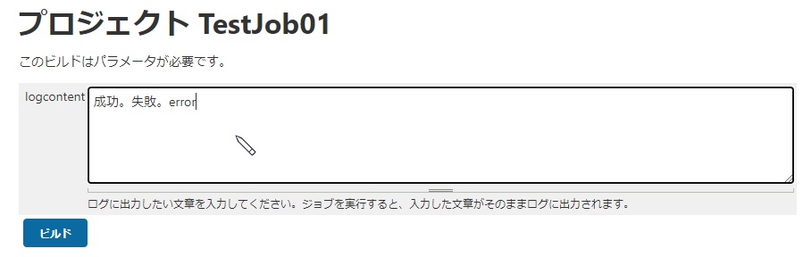
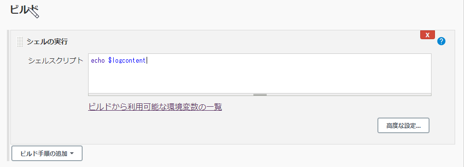
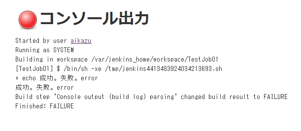
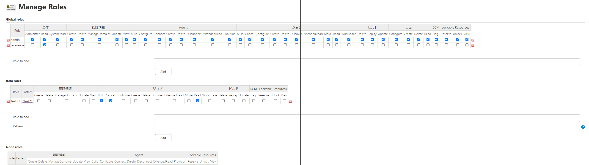
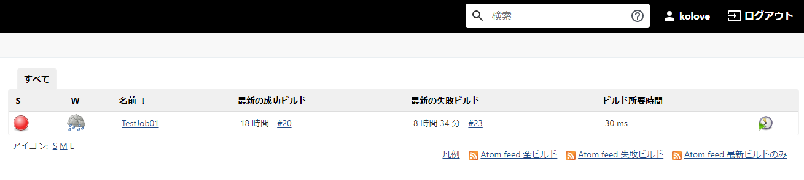
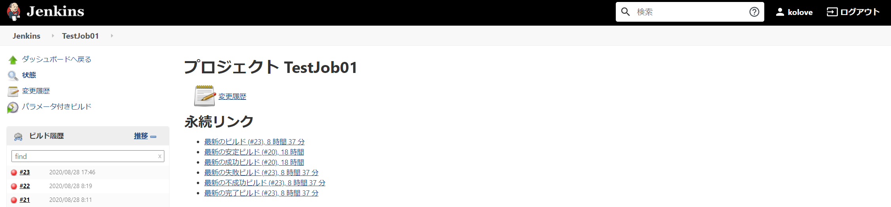

# Jenkins Tips[Jenkins]

JenkinsのTipsをメモしていきます。

## ジョブ内でビルドパラメーターを利用する

下図のような、ジョブ実行時にテキストベースで指定したパラメーターを使用する方法。



ジョブの設定画面で、「ビルドのパラメータ化」の名前を設定する。


ビルド設定にて、`$ビルドパラメータの名前`で設定すると利用することができる。

※シェルの実行の場合だけかも。他のビルド手順は未確認。

```bash
echo $logcontent
```



ジョブを実行すると、指定したパラメータが利用できていることが分かる。


## コンソールログを元にジョブの成功/失敗を判定する[Log Parser]

[Log Parser](https://plugins.jenkins.io/log-parser/#documentation)というプラグインを使うと、指定した条件で、ジョブの実行によって出力されるコンソールログを解析してくれる。解析した結果、ジョブを成功扱いにしたり、逆に失敗扱いにすることができる。

例えば、失敗になって欲しいジョブが何かしらの理由で成功となってしまう（サードパーティ製の処理をしており、処理結果を変えることができない…とか）場合に、出力されるコンソールログを元に、失敗にたおすことができる。

### 使い方

`Log Parser`プラグインをインストールし、Jenkinsを再起動する。

`Jenkinsの管理` -> `システムの設定` -> `Console Output Parsing` で「追加」ボタンを押し、`Description`にルールの概要、`Parsing Rules File`にルールが記載されたファイルのパスを記載する。


※**補足：** パスの指定がちょっとハマりどころ。どうも、相対パスだと読み取ってくれないようで、**絶対パスで指定する**必要がありそう。（相対パスでもできるやり方をご存知の方教えていただけると…）絶対パスで指定する場合は、Jenkinsのホームディレクトリ（例だと`/var/jenkins_home`）で指定する。ルールが記載された実ファイル自体は、Jenkinsのホームディレクトリで指定されている実際のディレクトリに配置する必要がある。今回の例だと、Jenkinsホームディレクトリの実態は`/home/(UserName)/jenkins`としているので、この配下にルールファイルを配置していく。ファイルの配置と設定が噛み合わない状態だと、ジョブ実行時に以下のようなExceptionが発生する。


上記の例で指定しているファイル`sqlerror.txt`には、

```txt
error /error/
```

としておく。これは、**errorという文字が含まれていたらジョブを失敗扱いとする**ルールとなる。

設定が終わったら、「保存」もしくは「Apply」ボタンを押す。これでルールの定義自体は終わり。

次に、ルールを設定したいジョブの設定画面を開く。`ビルド後の処理の追加`で、`Console output (build log) parsing`を選択する。すると、入力エリアが表示されるので設定を行う。

 - `Mark build Failed on Error`をチェックON
 - `Use global rule`を選択し、`Select Parsing Rules`で先ほど定義したルール`SQL Error`を選択


以上で設定が完了。

ジョブを実行し、コンソールログに`error`が含まれていると、ジョブが失敗扱いとなることが分かる。便利～。



## ユーザー/ジョブごとに権限を設定する[Role-based Authorization Strategy]

[Role-based Authorization Strategy](https://plugins.jenkins.io/role-strategy/)というプラグインを使うと、ユーザーごとやジョブごとに権限を設定することができる。例えば、ユーザーAには全てのジョブの編集・実行権限、ユーザーBには一部のジョブの実行権限だけを付与したりすることができる。

### 使い方

`Role-based Authorization Strategy`プラグインをインストールし、Jenkinsを再起動する。

`Jenkinsの管理` -> `グローバルセキュリティの設定` -> `権限管理` で`Role-based Strategy`を選択し、「保存」もしくは「Apply」ボタンを押す。これによって、`Jenkinsの管理`に`Manage and Assign Roles`が表示される。


これをクリックすると、権限の管理メニューが表示される。

`Manage Roles`で権限自体の設定を行う。
`Assign Roles`で設定した権限をユーザーに割り当てることができる。


まずは、`Manage Roles`をクリックし、権限自体の設定を行っていく。権限の単位として、`Global roles`、`Item roles`とある（`Node roles`は割愛）。それぞれ以下のような権限管理が可能となっている。

 - `Global roles`は、ジョブ関係なく、Jenkins全体
 - `Item roles`は、`Pattern`に該当するジョブ毎

ここでは例として、「`kolove`ユーザーは`Test`で始まるジョブのみ実行権限がある」設定を行ってみる。

`Global roles`で、全体のRead権限を持つreferenceロールを追加する。`Role to add`にロール名`reference`を入力し「Add」ボタンを押すと、ロールが一覧に追加される。あとは、付与したい権限のチェックを入れればロールが付与される。

※補足：`Global roles`で、全体のRead権限を付与しないと、そもそもJenkins自体にアクセスできないため、必ず付与する必要がある。付与していない状態だと、Jenkinsにログイン自体はできるが、「全体/Readパーミッションがありません」と表示され何も操作できない状態となってしまう。

`Item roles`を設定していく。`Role to add`にロール名`TestJob`、`Pattern`に`Test.*`と入力し「Add」ボタンを押すと、ロールが一覧に追加される。`Pattern`には正規表現が利用でき、この設定の場合は「Testで始まるジョブ」が対象とされる。あとは、一覧で付与したい権限のチェックを入れればロールが付与される。ここでは、ジョブの参照と実行権限を付与したいため、`ジョブ - Build、Cancel、Read`をチェックONにする。

ここまで設定が終わったら、「Save」または「Apply」ボタンを押して保存を行う。ここまで設定した状態が下図の通り。



次に、`Assign Roles`をクリックし、作成した権限をユーザーに割り当てていく。

`Global roles`の`User/group to add`にユーザー名`kolove`を入力し「Add」ボタンを押すと、ユーザーが一覧に追加される。あとは、`reference`をチェックONにすれば、先ほど作成した`refernece`権限が`kolove`に付与されたこととなる。

`Item roles`の`User/group to add`にユーザー名`kolove`を入力し「Add」ボタンを押すと、ユーザーが一覧に追加される。あとは、`TestJob`をチェックONにすれば、先ほど作成した`TestJob`権限が`kolove`に付与されたこととなる。

ここまで設定が終わったら、「Save」または「Apply」ボタンを押して保存を行う。ここまで設定した状態が下図の通り。


以上で、「`kolove`ユーザーは`Test`で始まるジョブのみ実行権限がある」権限設定ができた。該当ユーザーでログインし、閲覧できるジョブを確認する。

※システムユーザーの場合：


※`kolove`ユーザーの場合：





### 参考サイト

[Jenkins がもっと便利になるおすすめプラグイン 8 つ](https://blog.fenrir-inc.com/jp/2012/12/jenkins_plugins.html)
