# 2020年に向けて自分用ドキュメントツールを見直してみた[Visual Studio Code][VuePress][GitHub Pages][GitHub Actions]

特に理由は無いですが2020年も近いことですし自分用ドキュメントツールを見直してみようかと思います。

本稿では、ドキュメントツールを見直した際に行った作業を記録しておきます。

[[toc]]

## 前置き

自分用のメモとして、技術的なことを調査した内容や検証してみた結果を、ドキュメントツールで記録をしていました。「前にアレやったことあったけどどうだったかな～」といった際に見直すことができたり、記録をする行為を経て「ああ、自分この辺わかってないなー」と気付けるきっかけにもなったりとメリットを感じていました。

### これまで使っていたドキュメントツール

2009年～2016年まで：pukiwiki

　PHPで動作するウィキクローンの一つ。自宅のノートPCをサーバーにして立ち上げてました。引越しを機に廃止。

2016年～2019年（現在）：Crowi-Plus

　Markdownで書けるWiki。pukiwikiとは違ったWikiサービス＆Markdownに慣れたかったので採用(pukiwikiでも頑張ればMarkdownで書けそうだけど）。自宅PCだと電源を入れっぱなしにする必要があるなど色々と面倒だったので、AzureにVMを立てて管理していました。現在もこれで運用中。


## どんなドキュメントツールを使いたいか

- Markdownで書きたい
  - リアルタイムでプレビューしたい
  - 画像を貼りたい
- クラウドにのせる
  - クラウドサービスを使うのにお金をかけたくない
    - Azureは無償の範囲内で使えて入るが、その恩恵が受けられなくなる可能性もあるので事前に対策しておきたい気持ちもあった。
    - GCPの無料枠も悪くはないと思ったが今回はパス
  - GitHub Pagesに公開したい
    - ドキュメントは最終的にはGitHub Pagesに公開したい（GitHubのCommit色をつけたい欲求も満たされる）
- ツールは今っぽいサービスを使いたい
  - GitBook v1（オンプレ向け）はメンテされていないなのでNG
  - GitBook v2 はホスティングのみなのでNG
  - docsifyも魅力的ではあるが、メンテされていない？
  - MkDocs python基盤のMarkdownで書けるドキュメントツール。これも候補だった
  - VuePress
    - 去年あたりから流行っていそう？面白そうなので使ってみたい

ってことでVuePressを使ってみることにしました。

## [VuePress](https://vuepress.vuejs.org/)とは

VuePressは、Vue.jsの作者Evan You氏が作成した静的サイトジェネレータです。Markdownで書かれたファイルを元にHTMLを生成することができるのが特徴です。他にも、Markdown内でVueが使用できたり、Vueを利用してカスタムテーマの開発が可能だったりするそうです。

## 環境を準備する

VuePressを使ったドキュメント管理をするための環境を作ります。

利用OSやソフトウェアは以下を使用しています。

- OS: Windows 10
- Visual Studio Code: v1.40.2
- Node.js： v10.16.3
- npm： v6.9.0
- VuePress： 1.2.0

## 1. Visual Studio Code をインストールする

ドキュメントのエディタとして、Visual Studio Codeを使用します。
[公式サイト](https://azure.microsoft.com/ja-jp/products/visual-studio-code/)よりダウンロードしインストールします。

Visual Studio Codeのインストールが完了したら、Markdownを便利に編集するために、以下のExtensionをインストールします。

- Markdown All in One
  - Markdownファイルを開いた状態で`Ctrl + KV`するとプレビューが表示される。
- markdownlint
- Paste Image
  - クリップボードに画像をコピーした状態でVSCode上で`Ctrl + Act + V`するとMarkdown上に画像をペーストできる。
- Excel to Markdown table
  - Excel上のセルをコピーした状態でVSCode上で`Shift + Alt + V`するとMarkdownの表形式でペーストできる。
- ※Markdownとは直接関係ないが、以下のExtensionもついでにインストールしておく
  - Japanese Language Pack for Visual Studio Code
  - vscode-icons

### 1.2. Paste Imageの設定

クリップボードにコピーしている画像をMarkdownへ貼り付けしてくれる便利なExtensionですが、既定の設定のままだと画像の保存先がいまいちなので少し設定を変えます。

#### Default Name

既定のファイル名を定義できます。今回はハイフンを除いただけ。


#### Path

画像の保存先を定義できます。今回は`src\public\images`ディレクトリに格納したいので変更しました。さらにMarkdownのファイル名のフォルダを切った上で格納するようにしています。

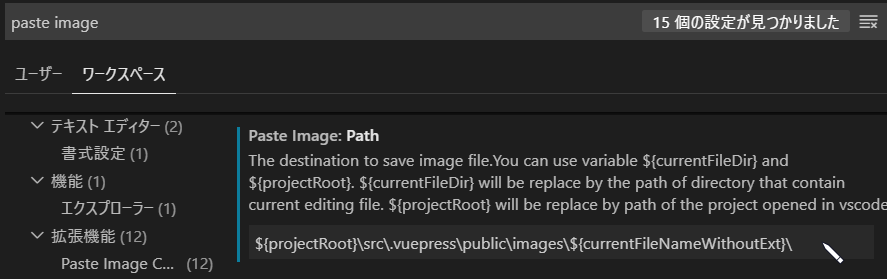

#### Prefix

Markdown上の画像のリンクパスのプレフィックスを定義できます。前述の`Path`の設定でリンクのパスが下記の通り生成されるようになります。

``

しかし、VuePressの開発環境上で表示しようとするとリンク不正となりブラウザ上で表示エラーとなってしまいます。

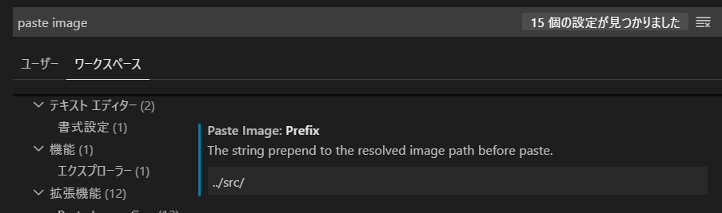

## 2. Node.js をインストールする

VuePressを使うにはNode.jsが必要なためインストールします。
[公式サイト](https://nodejs.org/en/download/)よりダウンロードしてインストールします。

インストールが終わったらコマンドを叩いて確認します。（npmも一緒に入るはず）

```bash
$ node --version
v10.16.3

$ npm --version
6.9.0
```

## 3. VuePress をインストールする

npmを使ってインストールします。

```bash
$ mkdir mywiki
$ cd mywiki
$ npm init -y
$ npm i -D vuepress
```

しばらくするとインストールが完了します。コマンドを叩いてインストールされたことを確認しまします。

```bash
$ npm list vuepress
`-- vuepress@1.2.0
```

## 4. VuePress の設定

Markdownを書き始める前に、VuePressの設定周りをいじっておきます。

### 4.1. ディレクトリを構成する

VuePressのディレクトリを構成します。詳しくは公式サイトの[ディレクトリ構造](https://vuepress.vuejs.org/guide/directory-structure.html)を参照ください。

今回は以下の通り構成しています。

```txt
.
├ docs
│ ├ assets
│ ├ images
│ ├ [Markdownを元に生成されたhtmlファイル、ディレクトリ]
│ ├ 404.html
│ └ index.html
├ src
│ ├ .vuepress
│ │ ├ public
│ │ │ └ images
│ │ │   └ [画像を格納するディレクトリ、ファイル]
│ │ └ config.js
│ ├ [Markdownを格納するディレクトリ、ファイル]
│ └ README.md
└ package.json
```

#### 4.1.1. docsディレクトリ配下

docsディレクトリ配下は、VuePressのビルド時に自動的に生成されます。なので事前準備としてはdocsディレクトリを作成しておくだけでOKです。

また、docsディレクトリはGitHub Pagesの公開ディレクトリとして設定しますが、詳しくは後ほど。

#### 4.1.2. srcディレクトリ

Markdownや挿入したい画像などを格納するディレクトリです。今回はVuePressのビルド対象としているルートディレクトリとなります。docsディレクトリとは違い、srcディレクトリ配下のファイル群は全て自分で作成していきます。

Markdownはsrcディレクトリ配下に格納しますが、格納する相対パスとページルーティングパスが深く関連しているので、Markdownの配置先は意識する必要があります。
| 相対パス               | ページルーティングパス     |
|--------------------|-----------------|
| src/README.md      | /               |
| src/wiki/README.md | /wiki/          |
| src/wiki/test.md   | /wiki/test.html |

#### 4.1.3. src\.vuepressディレクトリ

`config.js`（VuePressの構成ファイル）や、画像などの静的ファイルを配置する`publicディレクトリ`を格納します。

publicディレクトリ配下は、VuePressをビルドするとdocsディレクトリ配下にコピーされます。

#### 4.1.4. package.jsonファイル

VuePressインストール時の過程で一緒に作成されます。

### 4.2. package.json にVuePress用コマンドを追記する

package.json に以下の通りVuePress用コマンドを追記します。

```json
～中略～
"scripts": {
  "dev": "vuepress dev src",
  "build": "vuepress build src"
},
～中略～
```

`dev`、`build`はsrcフォルダに対してそれぞれ、VuePressの開発環境を起動、ビルド（静的ファイルの生成）するコマンドとして使用します。

### 4.3. VuePressの構成ファイルを編集する

VuePressは、サイト構成に対して色々なカスタマイズが可能なようです。詳しくは公式サイトの[設定](https://vuepress.vuejs.org/guide/basic-config.html#config-file)や[構成リファレンス](https://vuepress.vuejs.org/config/)を参照ください。

今回はいくつかの設定値を編集し、以下のような設定としています。

```js
const fs = require('fs');
const rootpath = "./src"; // 操作対象のルートディレクトリパス

// ルートディレクトリ直下のディレクトリ名を取得する。
var childDirctories = fs.readdirSync(rootpath).filter((f) => {
  // .vuepressディレクトリは除く。
  return fs.existsSync(rootpath + "/" + f) && fs.statSync(rootpath + "/" + f).isDirectory() && f != ".vuepress";
})
// console.log(childDirctories);

// 各ディレクトリ配下のファイル名を元にsidebarのgroup要素とchildren要素を生成する。
// ※加えて、トップページ用の''も生成しておく。
var sidebarElement = [''].concat(childDirctories.map((dir) => {
  return {
    title: dir,
    collapsable: false,
    children: fs.readdirSync(rootpath + "/" + dir).map((filename) => {
      return childPath = dir + "/" + filename
    })
  };
}));
// console.log(sidebarElement);

module.exports = {
  title: 'aikazuyendo\'s memo',
  description: '個人的に気になったことを調査したりやってみた結果をメモしています',
  dest: 'docs/',
  base: '/mywiki/',
  markdown: {
    lineNumbers: true, // コードブロックに行番号を表示
    linkify: true, // URL記述を自動的にリンクさせる
    toc: {
      includeLevel: [2, 3, 4, 5, 6] // [[toc]]の対象とする見出しレベル
    }
  },
  head: [
    ['link', { rel: 'icon', type: 'images/png', href: '/images/favicon.png' }],
  ],
  themeConfig: {
    nav: [
      { text: 'Home', link: '/' },
      { text: 'About', link: '/about/' },
      { text: 'GitHub', link: 'https://github.com/yoshikazuendo/mywiki' }
    ],
    sidebar: sidebarElement
  }
}
```

#### 4.3.1. title Config

サイトのタイトルを定義できます。すべてのページタイトルとして反映されるようです。VuePressのデフォルトテーマの場合、ナビゲーションバーに表示されます。


#### 4.3.2. dest Config

srcフォルダ内のMarkdownに対してVuePressをビルドするため、ビルドで生成される静的ファイルをdocsフォルダに格納するように構成ファイルを編集します。
最終的には静的ファイルを含めGitHubにpushし、docsフォルダをGitHub Pagesの公開ディレクトリパスとするためこの設定を設けています。

#### 4.3.3. base Config

GitHub Pagesなどへデプロイする際に設定する必要があるようです。
例えば、GitHub PagesのURLが`https://yoshikazuendo.github.io/mywiki/`の場合は、base Configに`/mywiki/`を設定する必要があります。

#### 4.3.4. head Config

headタグへ情報を組み込みたい場合は`head Config`に記載をしていくそうです。ここでは、faviconを設定しています。`head Config`要素はList形式なので、他にも色々設定できるようです。

#### 4.3.5. themeConfig -nav-

サイトのヘッダー部分にナビゲーションのリンクを設定することができます。こちらもList形式なので複数設定が可能です。

#### 4.3.6. themeConfig -sidebar-

サイトの左側にサイドバーを表示することが可能です。ここでは、サイトマップ的に本サイトの全ページをリンクで並べたいですが、ページの増減がある度にこの要素も編集するのは少し面倒です。なので、`src`ディレクトリ配下のmarkdownファイルを対象に`sidebar`要素を生成するJavaScriptで補うこととしました。

ディレクトリを`sidebar`要素の`Group`とし、リンクのグルーピングも表現しています。

### 4.4. VuePressの開発環境を起動する

以下のコマンドを実行すると開発環境が立ち上がります。

```bash
$ npm run dev
```


表示されたURLにアクセスするとブラウザで動作確認ができます。


なお、開発環境を立ち上げた状態でMarkdownを修正すると、その内容がリアルタイムでブラウザに反映されます。

### 4.5. VuePressのビルドをする

以下のコマンドを実行するとビルドが行われ、htmlなどの静的ファイルが生成されます。

```bash
$ npm run build
```

今回は、docsフォルダ配下に静的ファイルが生成されます。


## 5. GitHub Pagesへ公開・アップロードする

## 6. GitHub Pagesへのアップロードを自動化する

[GitHub Actions](https://github.com/features/actions)を使って、GitHub Pagesへのアップロードの自動化をしてみます。
Markdownなどのファイルを編集し、masterブランチへのpushをトリガーにして…

 - VuePressのビルドを行い、Static Fileを生成する
 - 生成されたStatic Fileを、masterブランチへpushする

が行われるようにします。これらをGitHub Actionsに任せることで、普段は編集した内容をpushするだけとなるため対象ラクになるかな…と思っています。
GitHub Actionsは、Public Repositoryだと無料で利用できる（2020/09/01時点）のでケチっている私としてはとても嬉しいです。


GitHub Actionでの自動化の定義は、**ワークフロー**と呼ばれるYAML形式のファイルに記述していきます。ワークフローファイルは、`.github/workflows`ディレクトリ配下に`.yml`または`.yaml`ファイルで配置します。詳細は、GitHub Docsの[ワークフローを設定する](https://docs.github.com/ja/actions/configuring-and-managing-workflows/configuring-a-workflow)がわかりやすいかなと思います。

### 6.1. ワークフローファイルを作成する

GitHub Docsの[最初のワークフローテンプレートの追加](https://docs.github.com/ja/actions/getting-started-with-github-actions/starting-with-preconfigured-workflow-templates#adding-your-first-workflow-template)の通りに進めます。

GitHubの該当リポジトリにアクセスし、Actionをクリックします。

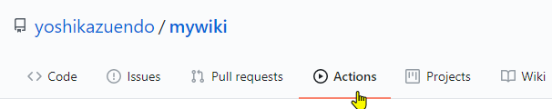

テンプレートがいくつか表示されるので、`Node.js`のテンプレートで`Set up this workflow`をクリックします。


すると、テンプレートの編集画面が表示されます。このエディタでも編集できますが、一旦Commitし、VSCodeでCloneしてしまえば慣れたエディタ上で編集することももちろん可能です。


### 6.2. ワークフローファイルを編集する

今回やりたい自動化に合わせて、ワークフローファイルを編集していきます。以下の感じ。

```yaml
# ワークフローの名前
name: Build VuePress And Push GitHub Pages

# ワークフローのトリガー。masterブランチへのpush時をトリガーとする。
on:
  push:
    branches: [ master ]

# ジョブ定義
jobs:
  # ジョブ名称。GitHubに表示される。
  build_and_push:
    # GitHubホストランナー(Windows Server 2019)を使う。
    runs-on: windows-latest
    # ステップ定義
    steps:
      # リポジトリをチェックアウトするアクション。
      - uses: actions/checkout@v2
      # Node.js環境を準備するアクション。
      - uses: actions/setup-node@v1
      # runはOSのシェルを実行する。
      - name: npm install
        run: npm install

      - name: npm run build
        run: npm run build

      - name: git settings
        # runはパイプ|を使って複数行のコマンドが指定できる。
        run: |
          git --version
          git config --global user.name "yoshikazuendo"
          git config --global user.email "ring2_bell@hotmail.com"

      - name: git commit and push static files
        run: |
          git add .
          git commit -am '[GitHub Actions Commit] deploy static files.'
          git push origin master
```

編集が終わったら、Commit & Pushしましょう。

### 6.3. ワークフローを動かしてみる（ついでにVSCodeでプルリク）

作成したワークフローが意図通り動くかどうか確かめるために、適当なファイルをPush（プルリク）してみます。

VSCodeのコマンドパレットで`Create Branch`を選択し、ブランチ名を入力します。


ソース管理タブを選択し、コミットメッセージを入力してコミットします。

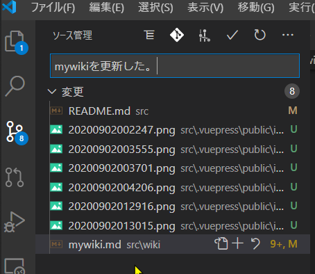

コミットまで終わったら、コマンドパレットで`Create Pull Request`を選択します。

:::warning
`Create Pull Request`を利用するためには、Extensionをインストールする必要があります。
:::


プルリク先のリモートブランチ名を入力します。


プルリク元のローカルブランチ名を入力します。

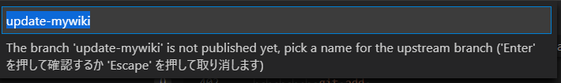

プルリクのタイトルを何を元にするか選択します。ここではひとまず`commit`を選択し、最後のCommitのメッセージを採用します。

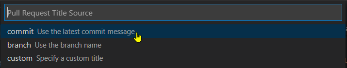

すると、これだけで**プルリクが作成されちゃいます。お手軽。** 作成されたプルリクは、以下のようにVSCode上の新しいタブとして表示されます。TitleやDescriptionの変更ができたり、プルリクマージまでできちゃうので、簡単な操作だけであればGitHubのページに遷移する必要すらなさそうな感じです。

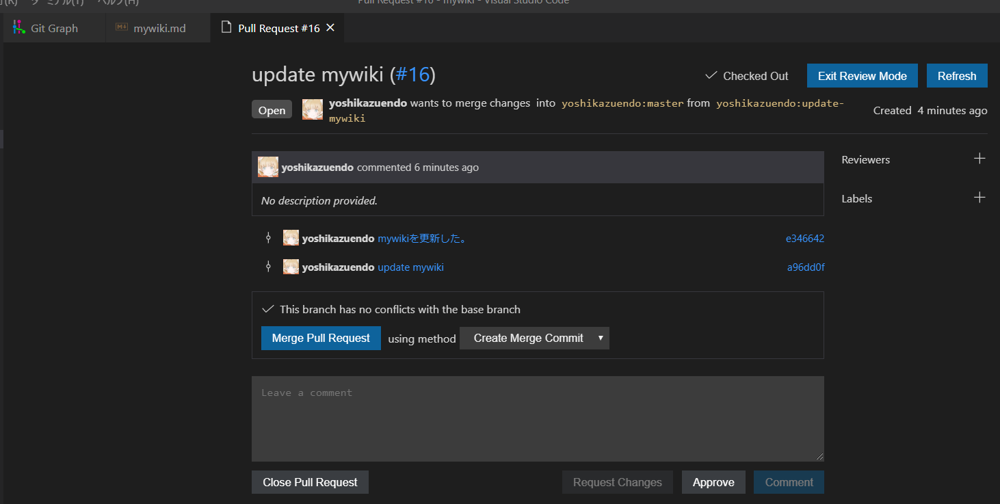

さて、話を戻して…これで`Merge Pull Request`をすると、作成したワークフローのトリガーとなるため、動きを確かめることができます。

VSCode上のプルリクの画面で`Merge Pull Request`をクリックします。


`This branch has no conflict ...`と表示されたら、`Create Merge Commit`をクリックします。


これで、プルリクがマージされます。GitHub Actionsのページを見てみると、以下のスクショのように`results`エリアにワークフローの実行状況が積まれました。リンクをクリックすると…

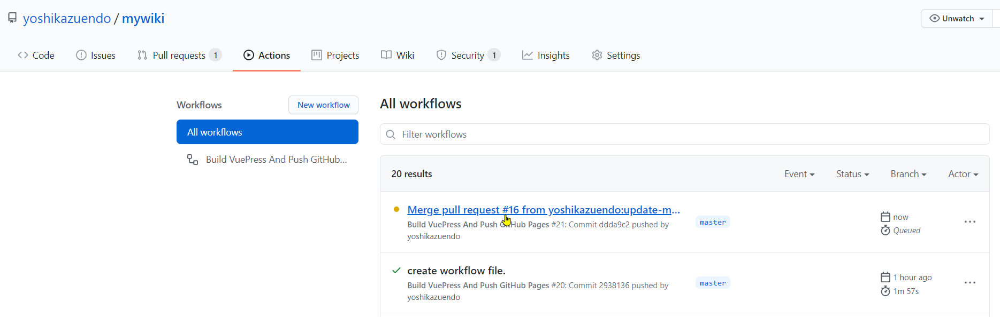

実行中のワークフローのサマリーページに遷移します。`1 in progress job`と表示され、ワークフローが実行中であることが分かります。左ツリーのジョブ名をクリックすると…

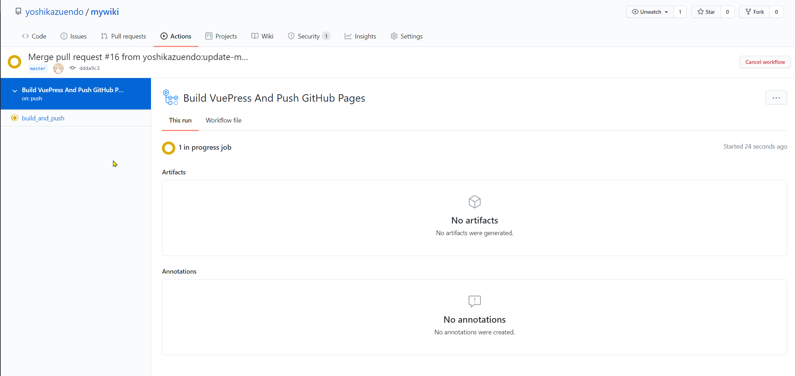

まさに実行中のジョブの状態がコンソールログのような見た目で確認することができます。


暫く待って、ワークフローが正常に完了すると、緑色のチェックマークが付きます。これで、無事作成したワークフローが正常完了することが確認できました。

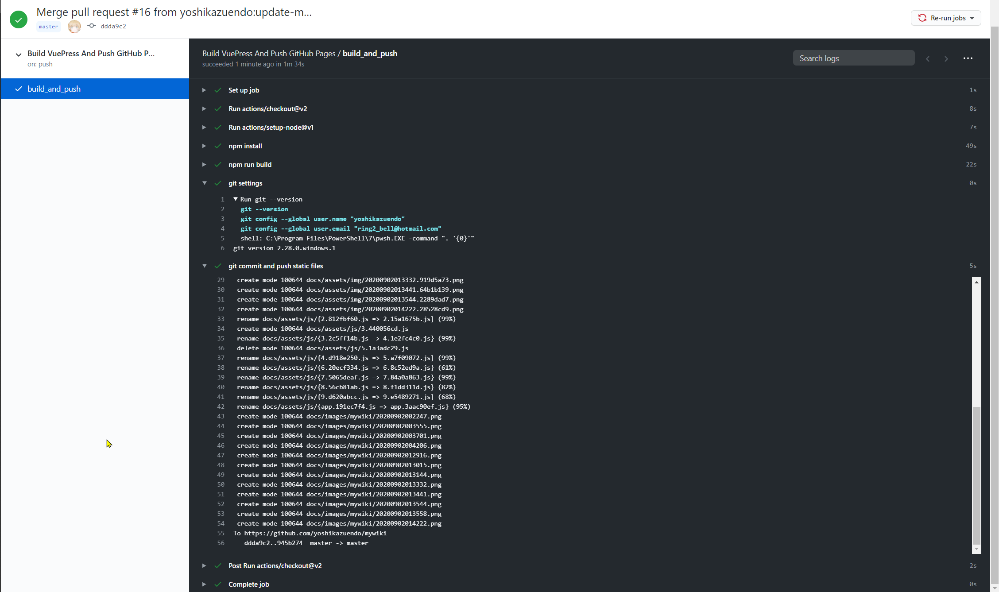

念の為、`npm run build`で生成されたであろう静的ファイルが`master`ブランチにcommit & pushされているかどうかをGitHub上で確認してみると、無事コミットログが載っていることが確認できました。

これで、ワークフローが意図通り動いていることが確認できました。

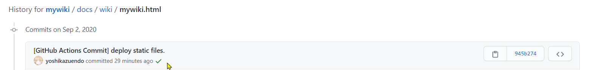

## まとめ（執筆中）

ここにまとめを書く。

## [2020/05/03追記] GitHub のSecurity Alertsを対応してみた

GitHubからSecurity Alertsのメール通知が飛んできていました。Security Alertsは、GitHub側にてリポジトリに悪影響を及ぼす脆弱性を検出してくれて、ユーザーに通知してくれる仕組みのようです。（詳しくは[公式ページ](https://help.github.com/ja/github/managing-security-vulnerabilities/about-security-alerts-for-vulnerable-dependencies)へ）

GitHubでかなり放置していましたが、時間ができたので対応してみようかと思います。


例えば以下のアラート。serialize-javascriptのバージョンが古くてアラートがあがっているようです。

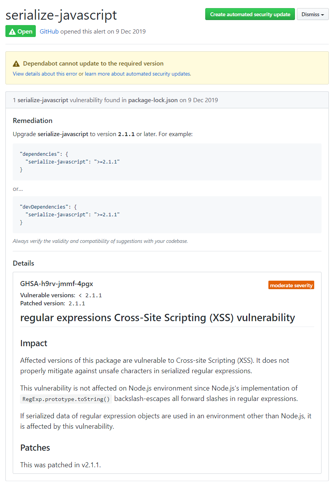

`package-lock.json`の`serialize-javascript`のバージョンが古いものが指定されているのが原因のようです。
mywikiで使っているVuePressのバージョンが古いのがそもそもの原因だと思うので、

```bash
$ npm update
```

でアップデートをし[push](https://github.com/yoshikazuendo/mywiki/commit/d6a699692522a18d9508cc2219a081f03dcdd835)します。

pushすると、Security Alertsが解消されるようです。Security Alertsのページにアクセスし、以下の通り綺麗に警告が消えていることが確認できました。
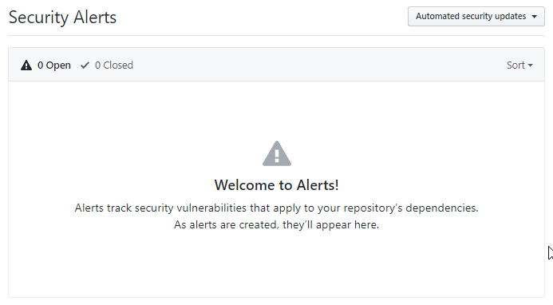
どうやら、他のSecurity Alertsも`npm update`で解決したようです。

## 参考サイト

- [VS code で最強の Markdown 環境をつくる方法 -『tool』](https://webmanab-html.com/tip/vs-code-markdown/)
- [Paste Image](https://marketplace.visualstudio.com/items?itemName=mushan.vscode-paste-image)
- [【VSCode】Visual Studio Code のユーザー設定をカスタマイズ](https://mattyan1053.hatenablog.com/entry/2018/08/02/021144)
- [VuePressで自分向けのWiki的なページを作成した](https://yoshinorin.net/2019/10/06/create-wiki-by-vuepress/)
- [VuePress入門](https://www.nxworld.net/services-resource/hello-vuepress.html)
- [VuePress+GitHub Pagesで独自ドメイン＋HTTPS対応のサイトを作る in 2018](https://qiita.com/crea/items/9751c50d4c15a6b60ae1)
- [VuePress で静的ページを作成し、GitHub Pages に公開する](https://y4shiro.github.io/vue-press/)
- [【CircleCI】CircleCI 2.0からはじめる個人での簡単なCI導入方法 - githubとの連携まで](https://tweeeety.hateblo.jp/entry/2018/02/09/195345)
- [VuePressの基礎基礎メモ](https://nogson2.hatenablog.com/entry/2019/07/04/191648)
- [VuePress Config Reference](https://vuepress.vuejs.org/config/#basic-config)
- [GitHub Actions Docs](https://docs.github.com/ja/actions)

[fuzzynavel](http://fuzzynavel.centralus.cloudapp.azure.com:3000/)
