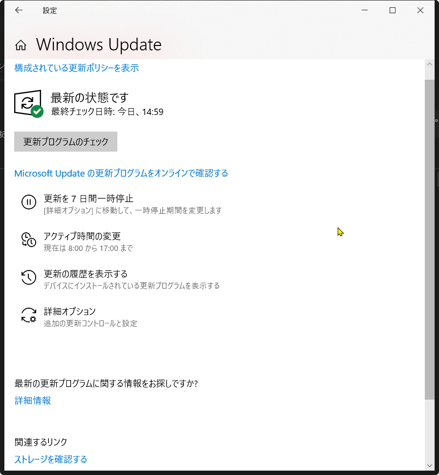
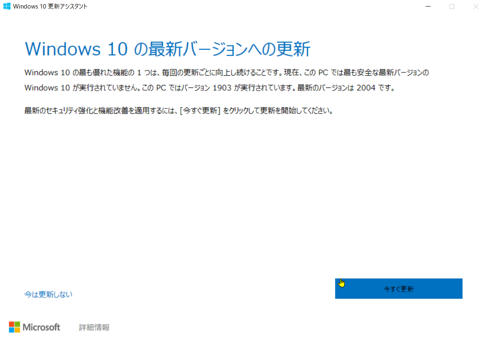
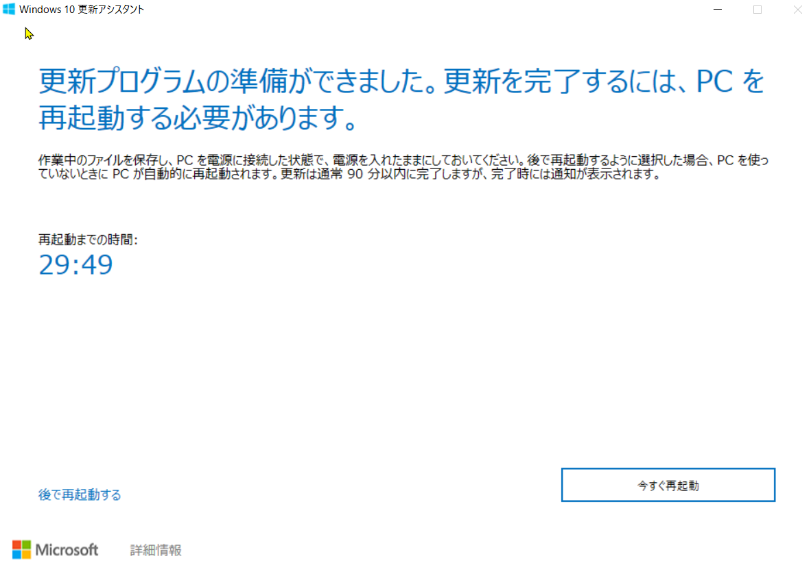
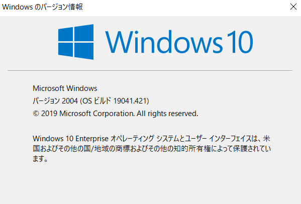
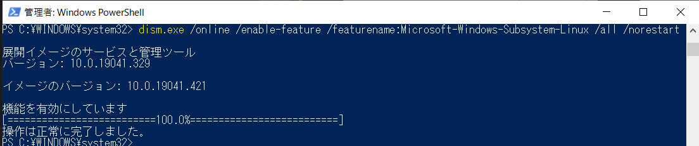

# WSL 1 をWSL 2 にアップデートしてdocker-composeを使ってGrowiを立ててみた（おまけつき）[WSL 2][docker-compose][Growi][Jenkins]

以前AzureのVM上に[自前のCrowi](http://fuzzynavel.centralus.cloudapp.azure.com:3000/)を立てる検証はやってみましたが、WSL 上でも同様の検証をしてみたいと考えていました。

また、WSL 2 も使ってみたかったので、docker-composeを使ってGrowiを立ててみる検証をしてみることにしました。その時のメモを残しておきます。

※無事立てられたとしても、自前のCrowiの移行は今の所考えてはないです…

[[toc]]

## 全体イメージ

WSL 1 が入っているWindows 10 PC に WSL 2 を導入し、Docker DesktopからWSL2 2 に対してGrowi をdocer-compose するイメージです。

※WSL 2 のUbuntu上にDockerを直接インストールするわけではありません。

1. Windowsバージョンを確認する
2. Windowsバージョンをアップデートする
3. WSL 2 に更新する
4. WSL のバージョンを確認する
5. WSL 2 を既定のバージョンとして設定する
6. Docker Desktop をインストールする
7. docker-composeでGrowiをインストール・立ち上げる

## 使用する端末・ツール

- Windows 10 搭載のPC
  - ※WSL 1 はインストール済みの状態
- WSL 2 
- Windows Docker Desktop

## WSL 2 とは

MS Docsの[WSL2の新機能](https://docs.microsoft.com/ja-jp/windows/wsl/wsl2-index)を参照。

## 手順

### 1. Windowsバージョンを確認する

> WSL 2 は、Windows 10、バージョン 2004、ビルド 19041 以上でのみ使用できます。 Windows のバージョンを更新しなければならない場合があります。

Windows Updateで見ると、「最新の状態です」と表示されるが…



`winver`で確認すると、バージョンが古いことがわかる。


ということで手動でアップデートをする。

### 2. Windowsバージョンをアップデートする

[Windows 10 のダウンロード](https://www.microsoft.com/ja-jp/software-download/windows10)を開く。
`今すぐアップデート`をクリックしてインストーラーをダウンロードする。
インストーラーを起動し、`今すぐ更新`をクリック。



結構時間がかかる。




PCを再起動する。


再起動すると、アップデートが完了。再度`winver`でバージョンを確認する。



### 3. WSL 2 に更新する

[Windows 10 用 Windows Subsystem for Linux のインストール ガイド](https://docs.microsoft.com/ja-jp/windows/wsl/install-win10#update-to-wsl-2)を主に参照しながら作業をする。

#### 3.1. 仮想マシンプラットフォームのオプションコンポーネントを有効にする

>WSL 2 をインストールする前に、"仮想マシン プラットフォーム" オプション機能を有効にする必要があります。
管理者として PowerShell を開き、以下を実行します。

`dism.exe /online /enable-feature /featurename:Microsoft-Windows-Subsystem-Linux /all /norestart`



有効にしたらPCを再起動する。

#### 3.2. WSL 2 を既定のバージョンとして設定する

>PowerShell で次のコマンドを実行して、新しい Linux ディストリビューションをインストールするときに WSL 2 を既定のバージョンとして設定します。

`wsl --set-default-version 2`

**ただし、うまく行かない場合が多い模様。次の小章を確認する。**


#### 3.2.1. 「仮想マシン プラットフォームの Windows 機能を有効にし、BIOS で仮想化が有効になっていることを確認してください。」が表示される場合

[Windows 10で仮想化プラットフォーム「Hyper-V」を有効にする](https://www.atmarkit.co.jp/ait/articles/1806/25/news026.html)を元に、Hyper-Vを有効化することで解消される。管理者権限でPower Shellを起動し、以下のコマンドを実行する。

`Enable-WindowsOptionalFeature -Online -FeatureName Microsoft-Hyper-V -All`

実行したらPCを再起動する。再起動したら、再度検証をする。

※参考：[Windows Subsystem for Linux のトラブルシューティング](https://docs.microsoft.com/ja-jp/windows/wsl/troubleshooting)

#### 3.2.2. 「WSL 2 を実行するには、カーネルコンポーネントの更新が必要です。」が表示される場合

[WSL 2 Linux カーネルの更新](https://docs.microsoft.com/ja-jp/windows/wsl/wsl2-kernel)
から、「最新の WSL2 Linux カーネル更新プログラム パッケージをダウンロード」をクリックし、インストーラーをダウンロードし、実行する。

インストールが終わったら、再度検証する。

## 4. WSL のバージョンを確認する

Power Shell を管理者権限で起動し、以下のコマンドを実行する。

`wsl -l -v`


## 5. WSL 2 を既定のバージョンとして設定する

Power Shell を管理者権限で起動し、以下のコマンドを実行する。

`wsl --set-default-version 2`


※この状態でMicrosoft Storeから新しいUbuntuをインストールすると下図の通りVersionが2で入る。


### 5.1. WSL 2 によるメモリ枯渇問題の処置をする

[WSL2によるホストのメモリ枯渇を防ぐための暫定対処](https://qiita.com/yoichiwo7/items/e3e13b6fe2f32c4c6120)にある通り、`C:\Users\(ユーザー名)\.swlconfig`ファイルに以下を記述し、`Vmmem`というプロセスにメモリが使われすぎないように処置を行う。

```bash
[wsl2]
memory=2GB
swap=0
```

## 6. Docker Desktop をインストールする

[公式サイト](https://www.docker.com/products/docker-desktop)よりダウンロードし、インストールをする。

インストーラーウィザードのConfigurationにて、`Enable WSL 2 Windows Features`のチェック項目が表示されるので、チェックONのままにする。

インストールが完了したら、Docker Desktopを起動し、`Setting`画面を開く。

General - `Use the WSL 2 based engine` がチェックONになっていることを確認する。

※WSL 2 を導入しているPCにインストールすると、デフォルトでチェックONらしい。（[Docker Desktop WSL 2 バックエンド](http://docs.docker.jp/docker-for-windows/wsl.html)）


Resources - WSL INTEGRATION - `Enable integration with my default WSL distro` がチェックONになっていることを確認する。


以上でDocker Desktopのインストールは完了。

**ここまで実施すると、WSL 2 上でDocker 及び docker-composeが可能となる。**

## 7. docker-composeでGrowiをインストール・立ち上げる

**WSL 2 上のUbuntuで**作業を行う。

Growiのdocker-composeをcloneする。

```bash
$ git clone https://github.com/weseek/growi-docker-compose.git growi
```

既定のymlファイルだと、Growi上でローカルのファイルシステムに対する画像ファイルなどのファイルのアップロードができないため、以下のファイルを編集する。

```bash
$ cd growi
$ vi docker-compose.yml
```

`docker-compose.yml`の以下を変更し保存する（コメントを外してあげればOK）。

```yml
# 変更前
# - FILE_UPLOAD=local     # activate this line if you use local storage of server rather than AWS

# 変更後
- FILE_UPLOAD=local     # activate this line if you use local storage of server rather than AWS
```

最後にコンテナを起動する。

```bash
$ docker-compose up -d
```

しばらく時間が経ったあとに、`docker ps`で以下のコンテナが立ち上がっているのが確認できればOK。

```bash
$ docker ps
CONTAINER ID        IMAGE                 COMMAND                  CREATED             STATUS              PORTS                      NAMES
c53c994b44ab        growi_app             "/sbin/tini -e 143 -…"   10 hours ago        Up 10 hours         127.0.0.1:3000->3000/tcp   growi_app_1
f6ebe0fa6158        mongo:3.6             "docker-entrypoint.s…"   10 hours ago        Up 10 hours         27017/tcp                  growi_mongo_1
66089c8fbfa4        growi_elasticsearch   "/usr/local/bin/dock…"   10 hours ago        Up 10 hours         9200/tcp, 9300/tcp         growi_elasticsearch_1
```

ブラウザでport:3000にアクセスし、Growiのトップ画面が出てくれば構築完了！


Docker DesktopのDashboardでも、growiのコンテナが表示され、RUNNINGになっていることが確認できる。


※Docker for Windowsを使っていた時だと仮想マシンが立ち上がっていたが、今回はDockerを立ち上げても、「Hyper-V」上では仮想マシンは起動していないことがわかる。よって、WSL 2 だけでDockerが動いていると言える。

※※厳密には、「Utility VM」という分離環境が呼ばれ、コンテナが実行されるらしい。([図解で理解できる（はず）Microsoftの仮想化技術――Windows上で稼働するLinux、動かしているのはどのテクノロジー？（その2） (2/2)](https://www.atmarkit.co.jp/ait/articles/1710/24/news010_2.html))

## 参考サイト

- 以下の記事はかなり参考になりました。
  - [WSL2導入｜WinアップデートからWSL2を既定にするまでのスクショ](https://qiita.com/tomokei5634/items/27504849bb4353d8fef8)
  - [Docker Desktop を WSL2 で使う (Windows 10)](https://www.engineer-memo.net/20200310-5516)
  - [Docker + Growiでイントラ向けWikiを立ち上げる](https://corgi-lab.com/linux/docker-growi-wiki/)
- [GROWI Docs docker-compose](https://docs.growi.org/ja/admin-guide/getting-started/docker-compose.html)
- ※WSL 1 の時はdocker-composeを使おうとするとすんなりとはいかない模様。
  - [WSLからdocker-composeでGrowiをたてようとしたらvolumesでつまづいた話](https://qrunch.net/@8ULd2sdFipvReKyP/entries/pwQ5BEywH9kHtrCA)
  - [WSLとDocker for WindowsでGROWIを動かすとvolumesでつまずく](https://blog.mahoroi.com/posts/2019/04/growi-wsl-docker-for-windows/)
- [《滅びの呪文》Docker Composeで作ったコンテナ、イメージ、ボリューム、ネットワークを一括完全消去する便利コマンド](https://qiita.com/suin/items/19d65e191b96a0079417)
  - `docker-compose down --rmi all --volumes`
- WSL関連
  - [WSL新版でLinuxをさらに使いやすく、Windows 10 May 2020 Update](https://xtech.nikkei.com/atcl/nxt/column/18/01290/052000005/)
    - WSL 2では以下の通りらしいのでdocker-composeもすんなり使えそう。
    - > すべてのシステムコールとの互換性が確保された。このため、LinuxディストリビューションがサポートしているDocker（OS上で区切られたアプリケーション動作環境である「コンテナ」を実現するソフトウエア）を通常通り起動できる。WSL 1には互換性がないシステムコールもあり、特定バージョンのDockerのみ起動可能だった。
  - [Windows Subsystem for Linux 2のメモリ管理を詳しく見る](https://ascii.jp/elem/000/001/981/1981180/)

## おまけ：JenkinsもWSL 2上に立ててみた

よく利用しているJenkinsもWSL 2 上に立ててみます。これはまた骨が折れるかな…と覚悟していましたが、前述した作業でWSL 2が入っておりかつDockerが使える状態であればさくっとできました。

※こちら（
[Install Jenkins using Docker Compose](https://dev.to/andresfmoya/install-jenkins-using-docker-compose-4cab)）のサイトを参考にさせてもらいました。

docker-compose用のyamlファイルを作成する。

```yaml
version: '3.7'
services:
  jenkins:
    image: jenkins/jenkins:lts
    privileged: true
    user: root
    ports:
      - 8081:8080
      - 50000:50000
    container_name: jenkins
    volumes:
      - ~/jenkins:/var/jenkins_home
      - /var/run/docker.sock:/var/run/docker.sock
      - /usr/local/bin/docker:/usr/local/bin/docker
```

作ったyamlファイルは、適当ななディレクトリ（`/home/(UserName)/jenkins-config`とか）に格納しておきましょう。

また、Jenkinsのデータを格納するためのディレクトリも切っておきます（`/home/(UserName)/jenkins`）。

これで準備が整うので、`docker-compose`しちゃいましょう。

```bash
$ cd jenkins-config
$ docker-compose up -d
```

これでJenkinsが立ち上がるので、`localhost/8081`にアクセスして確認してみます。

初めてのログインページが表示されると思うので、以下で管理者パスワードを取得して、ログインを行います。

```bash
$ docker exec jenkins cat /var/jenkins_home/secrets/initialAdminPassword
```

あとは、Jenkinsのページに沿って初期設定を済ませると、晴れてトップページが表示されます！WSL 2もdocker-composeも便利だね！


